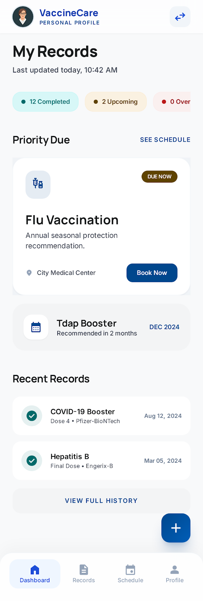
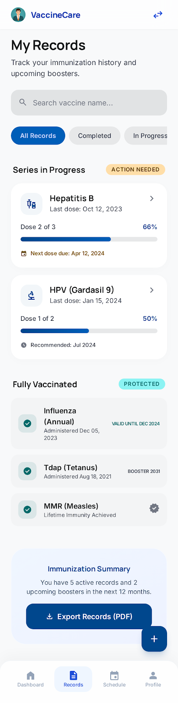
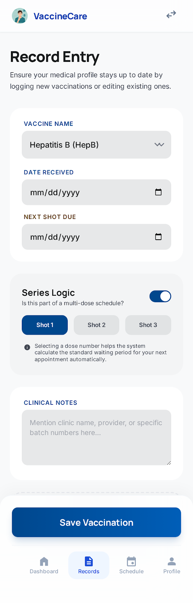
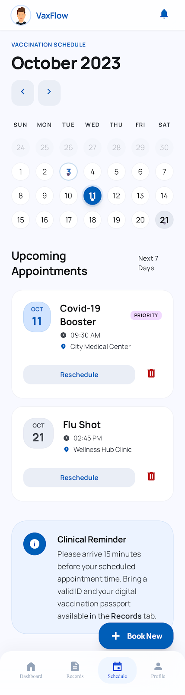
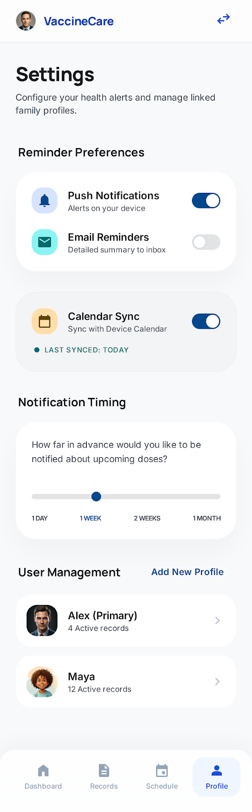
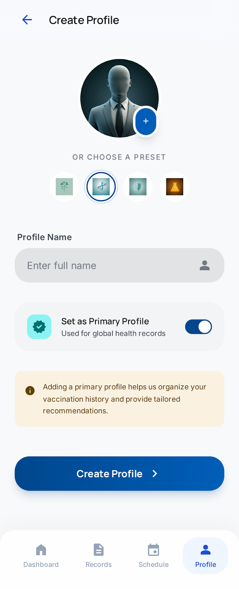

# VaccineCare — Brand & Style Guide

> **Living document** — reflects the Vitalis Blue (light) and Vitalis Midnight (dark) design system.

---

## 1. Brand Identity

| Attribute | Value |
|---|---|
| **App name** | VaccineCare |
| **Tagline** | "Your personal immunization companion" |
| **Design philosophy** | "Clinical Sanctuary" |
| **Voice & tone** | Confident, caring, precise. Never alarmist. Clinical but human. |

### Design Philosophy

The "Clinical Sanctuary" approach moves away from cold, sterile, grid-locked medical software aesthetics. The interface should feel as authoritative as a prestigious medical journal and as calming as a high-end wellness retreat.

Key principles:
- **No-line rule** — 1px solid borders are strictly prohibited for sectioning. Depth and boundary are defined through tonal layering alone.
- **Glassmorphism** — Floating elements (bottom navigation, sticky headers) use semi-transparent `surfaceContainerHighest` with backdrop blur.
- **Tonal hierarchy** — The UI is a series of stacked layers, each tier distinguishable by its surface token, never by borders.
- **Luxurious whitespace** — Generous, intentional spacing. If data feels cramped, step up to the next spacing token.

---

## 2. Color System

### 2.1 Vitalis Blue (Light Theme)

#### Primary

| Token | Hex | Role / Usage |
|---|---|---|
| `primary` | `#00478D` | Core brand blue; icon fills, active nav, link text |
| `onPrimary` | `#FFFFFF` | Text/icons on primary background |
| `primaryContainer` | `#005EB8` | Primary CTA button fill; progress bar gradient end |
| `onPrimaryContainer` | `#C8DAFF` | Text/icons inside primary container |
| `inversePrimary` | `#A9C7FF` | Primary color on inverse (dark) surfaces |
| `surfaceTint` | `#005DB6` | Material 3 tint overlay |

#### Secondary (Teal)

| Token | Hex | Role / Usage |
|---|---|---|
| `secondary` | `#006A6A` | Success / Protected state; PROTECTED badge |
| `onSecondary` | `#FFFFFF` | Text/icons on secondary background |
| `secondaryContainer` | `#8CF3F3` | Completed chip background; avatar default background |
| `onSecondaryContainer` | `#007070` | Text/icons inside secondary container |

#### Tertiary (Amber)

| Token | Hex | Role / Usage |
|---|---|---|
| `tertiary` | `#5F4300` | Due-soon / action-needed text |
| `onTertiary` | `#FFFFFF` | Text/icons on tertiary background |
| `tertiaryContainer` | `#7D5900` | DUE NOW badge fill; ACTION NEEDED banner |
| `onTertiaryContainer` | `#FFD489` | Text/icons inside tertiary container |

#### Error

| Token | Hex | Role / Usage |
|---|---|---|
| `error` | `#BA1A1A` | Overdue state; destructive actions |
| `onError` | `#FFFFFF` | Text/icons on error background |
| `errorContainer` | `#FFDED6` | Overdue badge fill; error callout background |
| `onErrorContainer` | `#93000A` | Text/icons inside error container |

#### Surface Hierarchy

| Token | Hex | Layer / Usage |
|---|---|---|
| `surfaceContainerLowest` | `#FFFFFF` | Interactive cards — "pop" forward naturally |
| `surfaceContainerLow` | `#F3F4F5` | Secondary content areas; form input backgrounds |
| `surfaceContainer` | `#EDEEEF` | Standard section backgrounds |
| `surfaceContainerHigh` | `#E7E8E9` | Progress bar track; divider-free list backgrounds |
| `surfaceContainerHighest` | `#E1E3E4` | Floating elements (glassmorphism base) |
| `surface` | `#F8F9FA` | Scaffold / base layer |
| `onSurface` | `#191C1D` | Body text; never use pure `#000000` |
| `onSurfaceVariant` | `#424752` | Secondary / muted body text |

#### Outline & Inverse

| Token | Hex | Role / Usage |
|---|---|---|
| `outline` | `#727783` | Placeholder text; muted chips; inactive toggles |
| `outlineVariant` | `#C2C6D4` | Ghost border fallback (use at 15% opacity only) |
| `inverseSurface` | `#2E3132` | Snackbar / tooltip backgrounds |
| `onInverseSurface` | `#F0F1F2` | Text on inverse surface |

---

### 2.2 Vitalis Midnight (Dark Theme)

#### Primary

| Token | Hex | Role / Usage |
|---|---|---|
| `primary` | `#85ADFF` | Periwinkle; core brand on dark; active nav, link text |
| `onPrimary` | `#002E6E` | Text/icons on primary background |
| `primaryContainer` | `#004099` | Primary CTA button fill; FAB background |
| `onPrimaryContainer` | `#D6E3FF` | Text/icons inside primary container |
| `inversePrimary` | `#00478D` | Primary color on inverse (light) surfaces |
| `surfaceTint` | `#85ADFF` | Material 3 tint overlay |

#### Secondary (Teal)

| Token | Hex | Role / Usage |
|---|---|---|
| `secondary` | `#4DD9D9` | Success / Protected state; more vibrant in dark mode |
| `onSecondary` | `#003737` | Text/icons on secondary background |
| `secondaryContainer` | `#005050` | NavigationRail active indicator; avatar background |
| `onSecondaryContainer` | `#6FF6F6` | Text/icons inside secondary container |

#### Tertiary (Magenta)

| Token | Hex | Role / Usage |
|---|---|---|
| `tertiary` | `#FBABFF` | Reserved for breakthrough moments only — max once per screen |
| `onTertiary` | `#5A005E` | Text/icons on tertiary background |
| `tertiaryContainer` | `#7E0083` | Tertiary container (milestone / system insight) |
| `onTertiaryContainer` | `#FFD6FE` | Text/icons inside tertiary container |

#### Error

| Token | Hex | Role / Usage |
|---|---|---|
| `error` | `#FF716C` | Overdue state; destructive actions |
| `onError` | `#690005` | Text/icons on error background |
| `errorContainer` | `#93000A` | Overdue badge fill |
| `onErrorContainer` | `#FFDED6` | Text/icons inside error container |

#### Surface Hierarchy

| Token | Hex | Layer / Usage |
|---|---|---|
| `surfaceContainerLowest` | `#010915` | Deepest layer; below base |
| `surfaceContainerLow` | `#091328` | Secondary content areas; form input backgrounds |
| `surfaceContainer` | `#0F1930` | Standard cards and modules |
| `surfaceContainerHigh` | `#192338` | Lifted cards; progress bar track |
| `surfaceContainerHighest` | `#1F2B49` | Glassmorphism base (60% opacity + blur) |
| `surface` | `#060E20` | Scaffold / base layer — deep navy, NOT `#000000` |
| `onSurface` | `#DEE5FF` | Body text |
| `onSurfaceVariant` | `#A3AAC4` | Secondary / muted body text |

#### Outline & Inverse

| Token | Hex | Role / Usage |
|---|---|---|
| `outline` | `#6D7490` | Placeholder text; muted chips; inactive toggles |
| `outlineVariant` | `#40485D` | Ghost border fallback (use at 20% opacity only) |
| `inverseSurface` | `#DEE5FF` | Snackbar / tooltip backgrounds |
| `onInverseSurface` | `#06163A` | Text on inverse surface |

---

### 2.3 Semantic Status Colors (Vaccination-specific)

| Status | Light color / token | Dark color / token | Component examples |
|---|---|---|---|
| **Complete / Protected** | `#006A6A` (`secondary`) | `#4DD9D9` (`secondary`) | PROTECTED badge, ✓ icon background, "Completed" stat chip |
| **Overdue** | `#BA1A1A` (`error`) | `#FF716C` (`error`) | Overdue dot in stat chip, overdue status badge |
| **Due Soon / Action Needed** | `#7D5900` (`tertiaryContainer`) | `#FBABFF` (`tertiary`) | DUE NOW badge, ACTION NEEDED banner |
| **In Progress** | `#00478D` (`primary`) | `#85ADFF` (`primary`) | Progress bar fill, IN PROGRESS badge |
| **Planned / Upcoming** | `#727783` (`outline`) | `#6D7490` (`outline`) | Upcoming stat chip |

---

## 3. Typography

Dual-font strategy: **Manrope** for display/headline/branding; **Inter** for body/label/data.

| Style | Font family | Size (sp) | Weight | Usage |
|---|---|---|---|---|
| `displayLarge` | Manrope | 57 | 400 (Regular) | Splash / hero numbers — rarely used |
| `displayMedium` | Manrope | 45 | 400 (Regular) | High-impact hero stats |
| `displaySmall` | Manrope | 36 | 400 (Regular) | Large feature callouts |
| `headlineLarge` | Manrope | 32 | 600 (SemiBold) | Page-level headings |
| `headlineMedium` | Manrope | 28 | 600 (SemiBold) | Section headings |
| `headlineSmall` | Manrope | 24 | 600 (SemiBold) | Card-level headings; vaccine series names |
| `titleLarge` | Manrope | 22 | 600 (SemiBold) | App bar title; primary screen title |
| `titleMedium` | Inter | 16 | 500 (Medium) | Card sub-headings; dialog titles |
| `titleSmall` | Inter | 14 | 500 (Medium) | List item titles; smaller card headings |
| `bodyLarge` | Inter | 16 | 400 (Regular) | Primary body text; patient instructions |
| `bodyMedium` | Inter | 14 | 400 (Regular) | Medical records, descriptions; default body |
| `bodySmall` | Inter | 12 | 400 (Regular) | "Dose X of Y" captions; secondary metadata |
| `labelLarge` | Inter | 14 | 500 (Medium) | Button labels; navigation labels |
| `labelMedium` | Inter | 12 | 500 (Medium) | Status chips, field labels (ALL CAPS) |
| `labelSmall` | Inter | 11 | 500 (Medium) | Badge text; compact metadata |

### ALL CAPS Form Field Labels

Field labels in forms (e.g. **VACCINE NAME**, **DATE RECEIVED**, **NEXT SHOT DUE**, **CLINICAL NOTES**) use `labelMedium` or `labelSmall` (Inter 12–11sp, weight 500) rendered in ALL CAPS:
- **Required fields** → `primary` blue
- **Next-step / contextual fields** → `tertiary` amber

This pattern creates a strong editorial hierarchy in data-entry screens without using divider lines.

---

## 4. Spacing & Layout

### Base Unit & Token Scale

| Token (px) | Common usage |
|---|---|
| 4 | Base unit; micro-gaps between inline elements |
| 8 | Icon-to-label spacing; tight internal padding |
| 10 | Badge/chip horizontal padding |
| 12 | Bottom-sheet internal gaps; compact list rows |
| 16 | Standard horizontal page padding (mobile); card internal vertical gap |
| 18 | Card `padding: EdgeInsets.all(18)` |
| 20 | Bottom-sheet top padding |
| 24 | Bottom-sheet horizontal padding; desktop page padding |
| 28 | Bottom-sheet top radius |
| 32 | Large section separation |

### Responsive Breakpoint

```dart
Breakpoints.desktop = 800  // pixels
```

| Screen width | Navigation | Page padding |
|---|---|---|
| `< 800px` (mobile) | `BottomNavigationBar` + `Drawer` | 16px horizontal |
| `≥ 800px` (desktop / tablet) | `NavigationRail` (left sidebar) | 24px+ horizontal |

---

## 5. Component Patterns

### 5.1 Cards

| Property | Value |
|---|---|
| Series card radius | `BorderRadius.circular(24)` |
| Timeline shot row radius | `BorderRadius.circular(12)` |
| Series card padding | `EdgeInsets.all(18)` |
| Card background | `surfaceContainerLowest` (`#FFFFFF` light / `#010915` dark) |
| Scaffold background | `surface` (`#F8F9FA` light / `#060E20` dark) |
| Bottom margin between cards | 16px |

**The No-Line Rule** — depth is achieved through background color contrast alone:
- ✅ DO: Place a `surfaceContainerLowest` card on a `surface` or `surfaceContainerLow` background.
- ✅ DO: Use `spacing-4` (16px) gaps instead of divider lines.
- ❌ DON'T: Add 1px solid borders to standard cards.
- ❌ DON'T: Use heavy drop shadows; if a float effect is needed, use a diffused shadow tinted with `onSurface` at 4–8% opacity.

---

### 5.2 Status Badges & Chips

| Property | Value |
|---|---|
| Shape | `BorderRadius.circular(999)` — fully rounded pill |
| Horizontal padding | 10px |
| Vertical padding | 4px |
| Text style | `labelSmall` or `labelMedium`, Inter, often ALL CAPS |
| Color | Per semantic status table (§2.3) |

Dashboard stat chips combine a colored dot icon + label text inside a pill container.

---

### 5.3 Buttons

#### Primary CTA (full-width)

| Property | Value |
|---|---|
| Background | `primaryContainer` (`#005EB8` light / `#004099` dark) |
| Text color | White (`onPrimary`) |
| Text style | Manrope SemiBold 600, title casing |
| Radius | ~16px, full width |
| Examples | "Save Vaccination", "Create Profile →", "Export Records (PDF)" |

#### Secondary / Text Links

- Color: `primary` blue, no background
- Often ALL CAPS: **"SEE SCHEDULE"**, **"VIEW FULL HISTORY"**, **"ADD NEW PROFILE"**

#### Outlined Chip Buttons (filter tabs)

| State | Background | Text |
|---|---|---|
| Active | `primary` fill | White (`onPrimary`) |
| Inactive | `surfaceContainerLow` fill | `onSurface` |

Example: "All Records · Completed · In Progress" filter row on the Records screen.

---

### 5.4 Form Inputs

| Property | Value |
|---|---|
| Background | `surfaceContainerLow` |
| Radius | ~16px |
| Border | None (no-line rule) |
| Placeholder text | `outline` grey, Inter Regular |
| Focus state | Background shifts to `surfaceContainerLowest`; subtle `primary` ghost border at 20% opacity |
| Field labels | ALL CAPS, `labelMedium` Inter — `primary` blue (required) or `tertiary` amber (next-step) |
| Clinical Notes textarea | Same style with resize handle corner |

---

### 5.5 Floating Action Button (FAB)

| Property | Value |
|---|---|
| Shape | Rounded rectangle (`FloatingActionButton.extended` style) |
| Background | `primaryContainer` (deep navy blue) |
| Icon | White `Icons.add` |
| Position | Bottom-right, floating above `BottomNavigationBar` |
| Visibility | Dashboard, Records, Schedule tabs — absent on Profile tab |

---

### 5.6 Progress Bars

| Property | Value |
|---|---|
| Track | `surfaceContainerHigh`, pill shape (`BorderRadius.circular(999)`) |
| Fill | `primary` blue, left-to-right (gradient: `primary` → `primaryContainer`) |
| Progress label | Right-aligned `labelMedium` Inter in `primary` (e.g. "66%") |
| Dose label | `bodySmall` Inter, e.g. "Dose 2 of 3" |

---

### 5.7 Navigation

#### Bottom Navigation Bar (mobile `< 800px`)

| Property | Value |
|---|---|
| Items | Dashboard · Records · Schedule · Profile (4 items) |
| Active state | `primary` color icon + label |
| Inactive state | `onSurfaceVariant` (muted blue-grey) |
| Background | `surface` or glassmorphism `surfaceContainerHighest` at 60% opacity + blur |

#### NavigationRail (desktop `≥ 800px`)

- Same 4 destinations in a vertical layout on the left edge.
- Active indicator: `secondaryContainer` teal-tint pill.

#### App Bar

| Position | Element |
|---|---|
| Left | Circular profile avatar + "VaccineCare" in `titleLarge` (`primary` blue) |
| Right | `Icons.swap_horiz_rounded` (user switch) |

---

### 5.8 Toggles & Switches

| State | Thumb | Track |
|---|---|---|
| ON | `primary` blue | `primaryContainer` |
| OFF | `outline` grey | `surfaceContainerHighest` |

---

### 5.9 Profile Avatar

| Property | Value |
|---|---|
| Shape | Circle crop |
| Default | Generated initials on `secondaryContainer` teal background |
| Upload badge | Small `primary` blue FAB circle with `+` at bottom-right of avatar |
| Sizes | ~64px (list), ~96px (profile header), ~120px (create profile) |

---

## 6. Iconography

- **Library:** Flutter Material Icons (`Icons.*`)
- **Preferred variants:** `_outlined` and `_rounded` — softer, medical-friendly feel
- **Avoid:** `_sharp` variants (too harsh for healthcare context)

### Status Icons

| Status | Icon | Background |
|---|---|---|
| Complete | `Icons.check_circle` | `secondaryContainer` teal circle |
| Overdue | `Icons.warning_amber_rounded` | `errorContainer` |
| Upcoming / Planned | `Icons.schedule_outlined` | `surfaceContainerLow` |
| In Progress | `Icons.timelapse_outlined` | `primaryContainer` tint |

### Feature Icons

| Feature | Icon |
|---|---|
| Vaccine / syringe | `Icons.vaccines` or `Icons.medical_services_outlined` |
| Calendar sync | `Icons.calendar_month_outlined` |
| Notifications | `Icons.notifications_outlined` |
| Export | `Icons.download_outlined` |
| User switch | `Icons.swap_horiz_rounded` |
| Settings | `Icons.settings_outlined` |

---

## 7. Dark Mode Guidelines (Vitalis Midnight)

The dark theme is named **"Vitalis Midnight"** after a deep-space, luminescent-lab aesthetic.

### Key Rules

| Rule | Detail |
|---|---|
| Surface is `#060E20` | Deep clinical navy — **not** `#000000`. Pure black kills the premium depth. |
| Primary is `#85ADFF` | Periwinkle blue provides warm contrast on dark backgrounds. |
| Secondary teal `#4DD9D9` | More vibrant in dark mode; use for all Protected / Completed status indicators. |
| Tertiary `#FBABFF` (magenta) | Reserved exclusively for breakthrough moments (milestone achieved, system insight callout). **Maximum once per screen.** |
| Shapes & spacing | Identical to light theme — no dark-mode-specific radii or padding. |
| Glassmorphism | `surfaceContainerHighest` (`#1F2B49`) at 60% opacity + `backdrop-filter: blur(12px)` for bottom nav / sticky headers. |
| Luminous shadows | Shadow color: `onSurface` (`#DEE5FF`) at 4–8% opacity with 32–64px blur. Never use black shadows. |
| Ghost borders | If accessibility requires a border, use `outlineVariant` (`#40485D`) at 20% opacity only. |

---

## 8. Responsive Behaviour

| Screen width | Navigation | Layout |
|---|---|---|
| `< 800px` (mobile) | `BottomNavigationBar` + `Drawer` | Single-column, 16px horizontal page padding |
| `≥ 800px` (desktop / tablet) | `NavigationRail` (left sidebar) | Wider content area, 24px+ page padding; possible 2-column layout |

The Flutter implementation switches layout based on:

```dart
MediaQuery.of(context).size.width >= Breakpoints.desktop
```

`Breakpoints.desktop = 800` (defined in `src/lib/core/constants/breakpoints.dart`).

---

## 9. Screen Gallery

Reference screens showing the design system in action. All images are located in `docs/ui_design/`.

### Dashboard

*Summary view: stat chips, priority-due hero card, recent records list, FAB, bottom nav.*



---

### Records

*Vaccination records list: in-progress series with progress bars, fully vaccinated section, export CTA.*



---

### Add / Edit Vaccination

*Record entry form: ALL CAPS labels, series-logic toggle, shot selector pills, clinical notes textarea.*



---

### Schedule

*Vaccination schedule: calendar view, upcoming appointments list, clinical reminder callout.*



---

### Settings & Profile Management

*Settings screen: reminder preference toggles, calendar sync, notification timing slider, user list.*



---

### Create Profile

*Profile creation: avatar upload, preset selector, name input, primary-profile toggle, info callout.*


